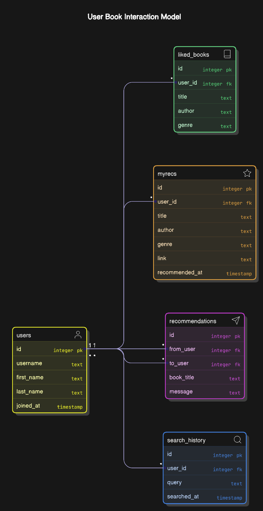

# **Book Buddy Telegram Bot**

A Telegram bot that allows users to search for books, like their favorites, receive personalized recommendations, track search history, and share book suggestions with friends.

### Check out this BOT -> `https://t.me/book_buddy7_bot`

## **Features**

- **Book Search**: Search for books by title, author, or keywords using Google Books API.  
- **Like Books**: Mark books as liked to improve recommendations.  
- **Personalized Recommendations**: Get daily book recommendations based on your preferences.  
- **Search History Tracking**: View and manage your past searches.  
- **Clear Search History**: Users can clear their search history.
- **Random Book Suggestion**: Users can get rancom book suggestion.
- **Book Details**: Get title, author, description, and purchase link for each book.  
- **Send Recommendations to Friends**: Share book recommendations with Telegram contacts. (contacts must be user of this bot) 
- **View Recommended Books**: Remove past searches when needed.  
- **Interactive Buttons**: Quick actions for liking books and viewing recommendations.  

## **Tech Stack**

- **Node.js** – Backend for bot logic
- **Telegraf.js** – Telegram Bot API wrapper
- **SQLite3** – Local database for storing user interactions
- **Google Books API** – Fetching book details
- **Render** – Cloud hosting platform
- **Express.js** - To keep the server running

## **Installation**

### **1. Clone the repository**
```sh
git clone https://github.com/chauhan-akshay123/Book_Buddy_Telegram_Bot.git
```

### **2. Install dependencies**
```sh
npm install
```

### **3. Set up environment variables**
Create a `.env` file and add:
```env
TELEGRAM_BOT_TOKEN=your-telegram-bot-token
GOOGLE_BOOKS_API_KEY=your-google-books-api-key
```

### **4. Start the bot**
```sh
node bot.js
```

## **Database Design**

The bot uses an SQLite database with four main tables:

### **Users Table**
- Stores user details such as username, first and last names, and the date they joined
- Connected to liked_books, myrecs, and search_history (One-to-Many).

- id: Integer
- username: text
- first_name: text
- last_name: text
- joined_at: timestamp

### **liked_books Table**
- racks books that users have liked, including title, author, and genre.
- Connected to users via user_id (Many-to-One).

- id: Integer
- user_id: Integer
- title: text
- author: text
- genre: text

### **myrecs Table**
- Stores books recommended to users based on their liked books and search history.
- Connected to users via user_id (Many-to-One).

- id: Integer
- user_id: Integer
- title: text
- author: text
- genre: text
- link: text
- recommended_at: timestamp

### **Recommedations Table**
- Stores books recommended by one user (from_user) to another user (to_user) with a message.
- Connected to users via from_user and to_user (Many-to-Many).

- id: Integer
- from_user: Integer
- to_user: Integer
- book_title: Text
- message: Text

### **Search History Table**
- Logs past searches made by users, storing the search query and timestamp.
- Connected to users via user_id (Many-to-One).

- id: Integer
- user_id: Integer
- query: Text
- searched_at: timestamp

## Database ER Diagram


                                 |
## **Deployment on Render**

### **1. Push Code to GitHub**
```sh
git add .
git commit -m "Initial commit"
git push origin main
```

### **2. Deploy to Render**
1. Go to [Render.com](https://render.com/)
2. Click **"New Web Service"** → Select **"Deploy from GitHub"**
3. Choose your repository and set **Start Command** as:
   ```sh
   node index.js
   ```
4. Add environment variables (**TELEGRAM_BOT_TOKEN** and **GOOGLE_BOOKS_API_KEY**)
5. Click **"Create Web Service"**

### **3. Keep Bot Running**
Enable "Keep Alive" in Render settings to prevent auto shutdown.

## **Usage**

- Start the bot by sending `/start`
- Search for a book using `/search <book name>`
- Like a book using `/like <book title>`
- View recommendations using `/recommend`
- Check search history with `/history`
- Clear search history using `/clearhistory`
- Share recommendations with friends via Telegram

## **Contributing**
Feel free to fork this repo, create pull requests, and report issues!

---

**Made with ❤️ for book lovers! 📚**

